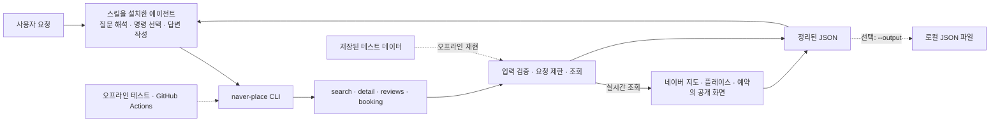

# Search Naver Map


Search Naver Map은 에이전트가 네이버 지도, Place, 방문자 리뷰, 공개 예약 정보를 조회할 때 쓰는 로컬 CLI와 스킬입니다.

검색·상세·리뷰·예약 조회를 네 개 명령으로 제공합니다. 에이전트는 자연어 요청에 맞춰 필요한 명령을 고르고, 결과에는 출처, 조회 시각, 확인 범위, 확인하지 못한 정보와 오류가 함께 담깁니다.

> NAVER가 제공하거나 보증하는 공식 프로젝트가 아닙니다.

## 다루는 문제

- 검색 결과, 장소 상세, 리뷰, 예약 정보가 서로 다른 화면에 흩어져 있습니다.
- 여러 조건을 함께 확인하려면 장소 후보를 하나씩 열어 비교해야 합니다.
- 빈 결과, 일부만 확인된 결과, 접근 거부, 화면 구조 변경을 구분하지 않으면 답변이 실제보다 확실해 보일 수 있습니다.

도구는 추천 순위를 산정하지 않습니다. 판단에 필요한 공개 정보를 조회해 같은 JSON 형식으로 정리합니다.

## 사용 장면

| 상황 | 자연어 요청 예시 | 확인하는 정보 |
| --- | --- | --- |
| 여행 계획 | “7월 20일부터 22일까지 두 명이 묵을 수 있는 제주 게스트하우스를 찾아줘.” | 지역, 객실, 인원 조건, 조회 시점의 예약 표시와 가격 |
| 식당·매장 비교 | “성수에서 떡볶이 메뉴가 확인되는 곳을 추려서 영업시간과 리뷰를 비교해줘.” | 메뉴, 영업시간, 주소, 공개 리뷰 |
| 매장 운영 | “잠실 꽃집 검색에서 우리 매장이 어디에 보이는지, 주변 매장과 공개 정보를 비교해줘.” | 조회된 검색 화면의 노출 위치, 상세 정보, 리뷰·예약 노출 |
| 애플리케이션 연동 | “장소 조회 결과를 일관된 JSON으로 받고 싶어.” | 명령 목록, 입력 검증, 결과 상태, 오류 코드 |

요청에 따라 명령 하나만 쓰기도 하고 여러 명령의 결과를 함께 확인하기도 합니다. 탐색 순서는 스킬을 설치한 에이전트가 질문에 맞춰 정합니다.

## 설치

Agent Skills를 지원하는 에이전트에게 다음과 같이 요청합니다.

> https://github.com/jseook11/Naver-Codex-SKILL.git 저장소의 `search-naver-map` 스킬을 설치해줘. 설치 문서를 읽고 전용 실행 환경을 준비한 다음 `capabilities --json`으로 작동 여부를 확인해줘.

저장소를 직접 실행해 보려면 Python 3.10 이상이 필요합니다.

```bash
git clone https://github.com/jseook11/Naver-Codex-SKILL.git
cd Naver-Codex-SKILL/search-naver-map
python3 scripts/bootstrap.py
bin/naver-place capabilities --json
```

준비 스크립트는 이 폴더에 `.venv`를 만들고 고정된 버전의 의존성을 설치합니다. 시스템 Python은 변경하지 않습니다.

## 동작 구조



장소 정보를 미리 모아 데이터베이스나 검색 색인에 쌓지 않습니다. 명령이 실행될 때 필요한 공개 정보만 읽습니다. 질문 해석과 최종 답변 작성은 스킬을 설치한 에이전트가 담당합니다.

## 명령 인터페이스

이 프로젝트는 HTTP 서버나 REST API를 열지 않습니다. 외부 진입점은 로컬 CLI인 `bin/naver-place`입니다.

| 명령 | 주요 입력 | 주요 결과 |
| --- | --- | --- |
| `search` | 검색어, 결과 수, 포함·제외 문구, 확인할 Place ID·이름 | 순서가 있는 장소 후보, 주소, 좌표, Place·예약 링크 |
| `detail` | Place ID 또는 네이버 Place URL | 기본 정보, 영업시간, 메뉴, 링크, 공개 콘텐츠 |
| `reviews` | Place ID 또는 URL, 리뷰 수, 사장님 답글 조건 | 방문자 리뷰, 답글 여부, 확인한 페이지 수 |
| `booking` | 검색어·예약 URL·사업 ID, 날짜, 인원, 시간 | 객실·상품·시간대별 공개 예약 정보 |

```bash
bin/naver-place search \
  --query "성수 떡볶이" \
  --limit 5 \
  --view compact
```

모든 조회 결과는 같은 틀을 사용합니다.

```json
{
  "schema_version": "1",
  "status": "ok",
  "capability": "map.search",
  "request": {},
  "data": {},
  "provenance": [],
  "completeness": {},
  "budget": {},
  "warnings": [],
  "errors": []
}
```

일부만 확인된 결과는 `partial`로 표시합니다. 확인된 데이터와 함께 조회 범위와 중단 이유를 반환합니다.

API 키나 OAuth 설정은 없습니다. 인증 헤더와 쿠키는 거부하며, `.netrc`와 환경 프록시는 사용하지 않습니다.

## 에이전트가 맡는 일

CLI는 입력 검증, 공개 정보 조회, 결과 정리와 오류 구분을 맡습니다. 스킬을 설치한 에이전트는 질문을 해석하고 필요한 명령과 순서를 고른 뒤, 여러 결과를 비교해 답변합니다. 업종별 추천 점수나 고정된 탐색 순서는 없습니다.

각 명령은 독립적으로 실행되며 이전 실행 상태를 저장하지 않습니다. 필요하면 `--output`으로 결과를 남겨 호출자가 비교할 수 있습니다. 일부 조회가 실패하면 확인된 데이터는 `partial`로 반환하고 중단 이유와 재시도 가능 여부를 함께 기록합니다.

예약 신청, 결제, 리뷰 게시, 매장 수정은 지원하지 않습니다. 실제 예약이나 변경은 제공된 네이버 링크에서 사용자가 직접 진행합니다. 자세한 역할과 데이터 흐름은 [구조와 데이터 흐름](search-naver-map/references/architecture.md)에 정리돼 있습니다.

## 안전과 한계

- 공개된 지도·Place·예약 정보만 읽으며 데이터 변경 요청은 보내지 않습니다.
- CAPTCHA, 로그인 장벽, 접근 제한, 요청 제한을 우회하지 않습니다.
- 접근 제한이 발생해도 브라우저 자동화, 프록시, 다른 계정으로 우회하지 않습니다.
- 예약 신청, 결제, 리뷰 작성, 메시지 전송, 매장 정보 수정은 지원하지 않습니다.
- 검색 위치는 조회한 화면 안에서 관찰된 위치입니다. 네이버 전체 순위나 완전한 수집 결과가 아닙니다.
- 예약 여부는 `true`, `false`, `null`로 구분합니다. 정보가 부족하면 `true`로 추정하지 않습니다.
- 가격, 재고, 영업시간, 검색 위치는 조회 시점의 관찰값이며 이후 상태를 보장하지 않습니다.
- 기본 출력에도 공개 닉네임과 리뷰 본문이 포함될 수 있습니다. 어떤 출력 범위도 완전한 익명화를 보장하지 않습니다.

## 저장소 구성

```text
search-naver-map/
├── SKILL.md              # 에이전트 실행 지침
├── bin/naver-place       # CLI 진입점
├── naver_place/          # 조회, 정규화, 오류 처리
├── references/           # 설치·명령·결과·설계 문서
├── scripts/bootstrap.py  # 폴더 전용 실행 환경 준비
└── tests/                # 저장된 응답과 계약 테스트
```

## 개발과 검증

```bash
cd search-naver-map
python3 scripts/bootstrap.py --dev
PYTHONDONTWRITEBYTECODE=1 .venv/bin/python -m pytest -p no:cacheprovider
.venv/bin/python -m compileall -q naver_place scripts
```

테스트는 저장된 응답과 모의 네트워크 응답을 사용합니다. Python 3.10과 3.12에서 실행되며 라이브 네이버 서비스가 계속 동작한다고 보장하지는 않습니다.

## 문서

- [설치와 업데이트](search-naver-map/references/installation.md)
- [명령과 입출력](search-naver-map/references/capabilities.md)
- [JSON 결과와 오류 코드](search-naver-map/references/result-contract.md)
- [구조와 데이터 흐름](search-naver-map/references/architecture.md)
- [사용 예시](search-naver-map/references/usage-examples.md)

## License

[MIT License](LICENSE)
