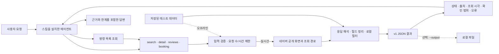

# 구조와 데이터 흐름

Search Naver Map은 호스팅 API나 추천 엔진이 아닙니다. 네이버의 공개 화면과 조회 경로에서 정보를 읽는 로컬 CLI, 결과를 정리하는 코드, 에이전트용 실행 지침으로 구성됩니다.

## 전체 흐름



## 데이터 수집

명령이 실행될 때 필요한 정보만 바로 읽습니다. 크롤링 큐, 사전 수집 작업, 데이터베이스, 검색 색인, 벡터 저장소는 없습니다.

명령별로 저장된 테스트 데이터를 넣어 일부 또는 전체 조회를 재현할 수 있습니다. 네트워크를 막는 정확한 범위는 명령마다 다르며, 테스트 데이터가 최신 네이버 상태를 대신하지는 않습니다.

## 조회 방식

네 명령은 입력과 실패 의미가 서로 달라 각각 분리돼 있습니다.

| 명령 | 현재 사용하는 공개 조회 경로 | 읽는 정보 |
| --- | --- | --- |
| `search` | 모바일 네이버 지도 검색 HTML | 장소 후보, 주소, 좌표, 조회된 위치, 링크 |
| `detail` | 네이버 Place 홈·피드 HTML, 영업시간 조회 | 기본 정보, 영업시간, 메뉴, 공개 콘텐츠 |
| `reviews` | Place 방문자 리뷰 HTML 추천순·최신순 snapshot | 최신 본문, 추천 본문, 추천 키워드 전용 표본과 공개 메타데이터 |
| `booking` | 네이버 Booking 조회 | 숙박 상품, 가격·재고·수용 정보, 시간대 |

현재 구현은 GET과 일부 공개 조회용 POST를 사용합니다. `reviews`는 `/review/visitor`와 `/review/visitor?reviewSort=recent` 두 공개 HTML 화면만 읽으며 GraphQL POST나 페이지네이션을 사용하지 않습니다. Place 유형의 canonical URL로 이동하는 안전한 네이버 내부 리다이렉트는 요청 예산에 추가로 포함될 수 있습니다. 다른 명령의 POST도 공개 정보 조회만을 위한 것이며 예약 신청, 결제, 리뷰 등록 같은 변경 요청은 보내지 않습니다.

리뷰 파서는 HTML의 Apollo `ROOT_QUERY` 키 인자를 JSON으로 해석합니다. 요청한 `businessId`가 일치하는 root 중 최신 본문은 `includeContent=true, sort=recent`, 추천 본문은 `includeContent=true`이면서 `sort`가 없는 root, 추천 키워드 전용 표본은 `includeContent=false`이면서 `sort`가 없는 root만 선택합니다. Apollo 상태 전체를 훑지 않고 선택한 root의 `items` 순서와 표본 소속을 유지합니다. 동일 ID가 여러 표본에 있으면 `data.reviews`에는 한 번만 두고 `sample_sources`·`sample_ranks`와 `data.samples.*.review_ids`로 소속을 보존합니다.

이 조회 경로들은 네이버가 공식 API로 공개하거나 안정성을 보증한 인터페이스가 아닙니다. 응답 구조가 달라지면 처리를 중단하고 `upstream_changed`를 반환합니다.

## 공통 처리

조회 결과는 다음 단계를 거쳐 같은 형식으로 정리됩니다.

1. 명령 인수와 Place·Booking 식별자 검증
2. 요청 수와 전체 실행 시간 확인
3. 공개 응답 조회 또는 저장된 테스트 데이터 읽기
4. 명령별 응답 해석과 로컬 문자열 필터
5. 선택한 범위에 맞춘 조회와 큰 필드·공개 메타데이터 축소
6. 상태, 출처, 확인 범위, 예산, 오류를 포함한 JSON 직렬화

지도 검색과 Place 상세는 공통 전송 계층에서 제한된 재시도를 사용합니다. 리뷰는 같은 안전 경계를 통과하는 두 공개 HTML GET만 수행하고 목록 페이지를 추가로 따라가지 않습니다. 예약 조회에는 지도·상세의 공통 재시도 정책이 적용되지 않습니다.

`compact`와 `standard`는 주로 결과 필드를 줄입니다. `booking --view full`은 설명, 이미지, 옵션을 확인하기 위해 추가 요청을 보낼 수 있으므로 요청 수와 결과 상태가 달라질 수 있습니다.

## 요청 제한

기본 실행 한도:

- 최대 40회 요청
- 전체 120초
- 연결 제한 15초 (`search`, `detail`)
- 응답 읽기 제한 30초
- 공통 전송 계층의 최대 시도 2회

`search`, `detail`, `reviews`에서 따르는 리다이렉트도 요청 수에 포함합니다. 남은 시간이 부족하면 개별 요청의 제한 시간을 줄이며, 한도를 넘으면 원인에 따라 `request_budget_exhausted` 또는 `time_budget_exhausted`를 반환합니다.

실시간 `reviews`는 `limit`이 1~10일 때 최신순과 추천순 HTML 화면을 차례로 읽습니다. `limit`은 각 표본의 반환 상한이며 네트워크 요청이나 페이지 수를 늘리지 않습니다.

## 답변 생성과 에이전트

스킬을 설치한 에이전트가 다음 일을 맡습니다.

- 사용자의 자연어 요청 해석
- 확인해야 할 근거 결정
- 명령과 실행 순서 선택
- 여러 JSON 결과 비교
- 구조화 메뉴가 부족할 때 공개 Place 이미지를 제한적으로 내려받아 비전으로 판독
- 출처와 한계를 포함한 최종 답변 작성

도구는 업종별 추천 점수나 고정된 탐색 순서를 제공하지 않습니다. 같은 질문도 이미 알고 있는 Place ID, Booking URL, 필요한 근거에 따라 실행 방식이 달라집니다.

메뉴 이미지 fallback은 에이전트 하네스에 속합니다. CLI는 `detail --view full`에서 공개 이미지 URL을 반환할 뿐, 이미지를 내려받거나 메뉴판을 인식하지 않습니다. 구체적인 발동 조건과 판독 한계는 [메뉴 이미지 fallback](menu-image-fallback.md)을 따릅니다.

## 메모리와 저장

각 명령은 독립적으로 실행되며 이전 실행 상태를 저장하지 않습니다. 예약 가능 여부도 캐시하지 않아 다음 실행에서는 공개 정보를 다시 확인합니다.

`--output`으로 JSON 파일을 남길 수 있지만 자동 이력 관리 기능은 아닙니다. 정기 비교가 필요하면 외부 스케줄러나 작업이 파일을 보관하고 차이를 계산해야 합니다.

## 지원하지 않는 작업

예약 신청, 결제, 리뷰 게시, 메시지 전송, 매장 수정 기능은 제공하지 않습니다.

실제 예약이나 변경은 조회 결과에 포함된 네이버 링크에서 사용자가 직접 진행합니다.

## 인증과 네트워크 안전

- API 키, OAuth, 로그인 세션을 받지 않습니다.
- 인증 헤더와 쿠키를 거부합니다. `.netrc`와 환경 프록시는 사용하지 않습니다.
- 응답 쿠키는 다음 요청으로 가져가지 않습니다.
- `search`와 `detail`은 HTTPS 네이버 주소로 향하는 리다이렉트를 최대 5번 따르고, 알려진 로그인·CAPTCHA 화면을 `blocked`로 분류합니다.
- `booking`은 리다이렉트를 따르지 않습니다. `reviews`는 `search`, `detail`과 같은 안전한 네이버 내부 리다이렉트 규칙을 사용합니다.
- 브라우저나 프록시로 우회하지 않습니다.

## 실행 기록과 테스트

상시 모니터링 서비스는 없습니다. 각 실행의 JSON에 다음 정보가 남습니다.

- 요청한 공개 출처와 작업
- 조회 시각과 실시간 여부
- 사용한 요청 수와 실행 시간
- 확인한 화면·항목 수와 중단 이유. 리뷰는 두 snapshot과 표본별 반환 수를 기록
- 경고, 오류 코드, HTTP 상태, 재시도 가능 여부

GitHub Actions는 저장된 응답과 모의 네트워크 응답을 사용해 Python 3.10과 3.12에서 회귀 테스트와 소스 컴파일 검사를 수행합니다. 라이브 네이버 서비스의 가용성을 감시하거나 보장하지는 않습니다.

## 코드 구성

```text
bin/naver-place                 CLI 진입점
naver_place/cli.py              인수 검증과 명령 연결
naver_place/contracts.py        상태, 오류, 출처, 확인 범위, 실행 한도
naver_place/transport.py        공개 HTTP 요청과 인증 차단
naver_place/capabilities/       search, detail, reviews, booking 조회
naver_place/serializers/        출력 범위와 JSON 직렬화
scripts/bootstrap.py            폴더 전용 Python 환경 준비
tests/                          저장된 응답과 계약 테스트
```
